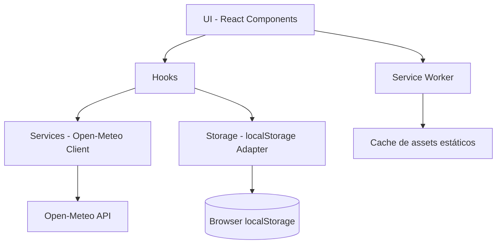
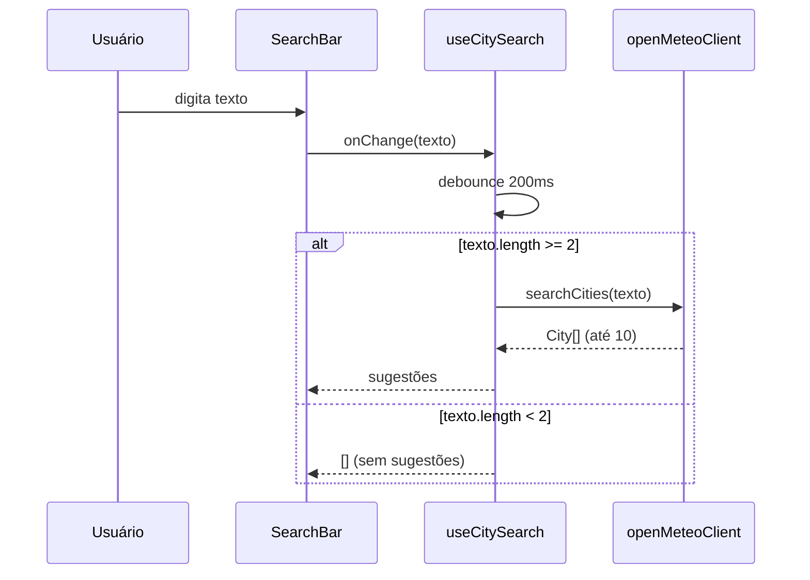
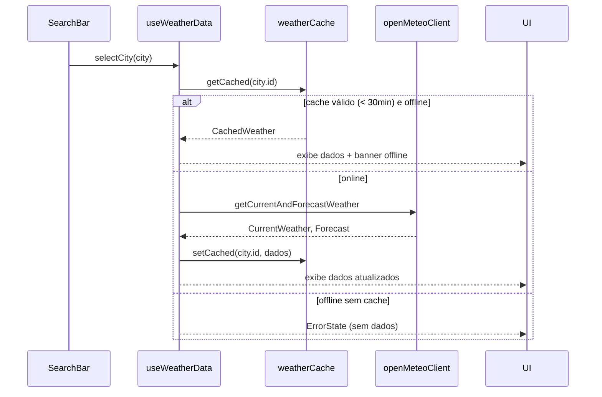

# Weather App — Plano Técnico

**Versão**: 1.0
**Data**: 2026-08-12
**Status**: Pronto para quebra de tarefas
**Entrada (fonte da verdade)**: [specs/weather-app-spec.md](../specs/weather-app-spec.md)
**Consumidor**: Task Agent

> Este documento define decisões de arquitetura e contratos (tipos/interfaces).
> Não contém implementação final — apenas assinaturas, esqueletos e exemplos
> mínimos necessários para orientar a quebra de tarefas.

---

## 1. Architecture

### 1.1 Visão geral

SPA client-only (sem backend próprio), rodando como PWA. Toda a lógica de
negócio roda no navegador; a única dependência externa é a API pública
Open-Meteo (geocoding + forecast). Persistência via `localStorage`. Cache de
dados de clima com TTL de 30 minutos guardado também em `localStorage`.



### 1.2 Camadas

| Camada | Responsabilidade | Pasta |
|---|---|---|
| UI | Componentes React puros de apresentação | `src/components/` |
| Hooks | Orquestração de estado, efeitos, chamadas a services | `src/hooks/` |
| Services | Acesso a dados (API HTTP, cache, storage) | `src/services/` |
| Types | Contratos compartilhados (TypeScript) | `src/types/` |
| Lib | Funções puras (conversão de unidade, formatação, debounce, mapeamento de weather code) | `src/lib/` |

### 1.3 Princípios

- Componentes de UI não fazem `fetch` diretamente; sempre via hooks/services.
- Services são funções puras/isoladas e testáveis sem DOM.
- Sem estado global via Context/Redux — estado vive em hooks compostos no
  componente raiz (`App`) e é passado via props/hooks customizados. Simplicidade
  antes de escalabilidade prematura (o app tem 1 tela principal).
- Sem chamadas de API diretamente em componentes de teste; mocks nos services.

---

## 2. Tech Stack

Já fixado pelo repositório (ver [package.json](../package.json)) — este plano
não introduz novas dependências:

| Categoria | Escolha | Justificativa |
|---|---|---|
| Linguagem | TypeScript (strict) | Segurança de tipos para contratos de API/domínio |
| UI | React 19 + Vite | Já definido no projeto; build rápido |
| Estilo | Tailwind CSS (dark glassmorphism) | Já definido; utilitário, sem CSS-in-JS extra |
| Estado | React hooks nativos (`useState`, `useReducer`, `useEffect`) | Dispensa lib de estado para o escopo do MVP |
| Dados remotos | `fetch` nativo (sem axios) | Evita dependência extra; Open-Meteo é simples REST/JSON |
| Persistência | `localStorage` via adapter próprio | Suficiente para favoritos/histórico/preferência/cache |
| PWA | `vite-plugin-pwa` (ou manifest + SW manual, a decidir na Task) | Gera manifest + service worker com Workbox, menos código manual |
| Testes unitários | Vitest + Testing Library | Já definido |
| Testes E2E | Playwright | Já definido |
| Lint/format | Biome | Já definido |
| Pacotes | pnpm | Já definido |

> Nenhuma nova dependência de runtime é necessária. A única decisão em aberto é
> usar `vite-plugin-pwa` (recomendado, reduz código manual de SW) vs. Service
> Worker escrito à mão — a ser confirmada na fase de Tasks.

---

## 3. Project Structure

```text
src/
  main.tsx                      # bootstrap da app + registro do service worker
  App.tsx                       # composição das seções principais + estado raiz
  components/
    SearchBar.tsx                # input + autocomplete (RF01)
    SearchSuggestionList.tsx     # lista de sugestões do autocomplete
    CurrentWeatherCard.tsx       # clima atual (RF02, RF08)
    ForecastList.tsx             # previsão de 5 dias (RF03)
    ForecastDayCard.tsx          # item individual da previsão
    UnitToggle.tsx                # alternância °C/°F (RF04, RF10)
    FavoritesList.tsx             # favoritos (RF05)
    HistoryList.tsx               # histórico de buscas (RF06)
    OfflineBanner.tsx              # indicador de offline/cache (RF07)
    InstallPrompt.tsx              # prompt de instalação PWA (RF09)
    ErrorState.tsx                 # estado de erro genérico com retry
    EmptyState.tsx                 # estado vazio (sem favoritos/histórico)
  hooks/
    useCitySearch.ts              # debounce + chamada de geocoding
    useWeatherData.ts             # orquestra clima atual + previsão + cache
    useTemperatureUnit.ts         # unidade + persistência (RF04, RF10)
    useFavorites.ts               # CRUD de favoritos (RF05)
    useSearchHistory.ts           # CRUD de histórico (RF06)
    useOnlineStatus.ts            # navigator.onLine + eventos online/offline
  services/
    openMeteoClient.ts            # chamadas HTTP a geocoding/forecast (com timeout)
    weatherCache.ts                # leitura/escrita do cache de clima (TTL 30min)
    storage.ts                     # adapter de localStorage (get/set/remove com parse seguro)
  types/
    city.ts
    weather.ts
    preferences.ts
    api.ts                          # tipos crus da resposta do Open-Meteo (ex.: GeocodingResult)
  lib/
    temperature.ts                # conversão C/F, arredondamento
    formatters.ts                  # datas, dia da semana pt-BR, timestamp relativo
    weatherCodeMap.ts              # mapeamento WMO code -> ícone/descrição pt-BR
    debounce.ts
public/
  manifest.webmanifest
  icons/ (192x192, 512x512, maskable)
tests/
  unit/                           # Vitest (espelha estrutura de src/)
  e2e/                            # Playwright
```

---

## 4. Data Model

Contratos compartilhados em `src/types/`. Cobrem RF01–RF10.

```typescript
// src/types/city.ts
export interface City {
  id: string;              // ex: "3448439" (id do Open-Meteo)
  name: string;             // "São Paulo"
  state: string;            // "SP" (derivado de admin1)
  country: "BR";
  latitude: number;
  longitude: number;
  timezone: string;         // "America/Sao_Paulo"
}

// src/types/weather.ts
export interface WeatherCondition {
  code: number;             // WMO weather code
  description: string;      // pt-BR, via weatherCodeMap
  icon: string;             // chave/emoji, via weatherCodeMap
}

export interface CurrentWeather {
  cityId: string;
  temperatureC: number;         // sempre armazenado em Celsius (fonte da verdade)
  feelsLikeC: number;
  humidity: number;             // inteiro, %
  windSpeedKmh: number;         // inteiro, sempre km/h (RF fixo, sem toggle)
  condition: WeatherCondition;
  sunrise: string;              // "HH:mm", timezone da cidade
  sunset: string;                // "HH:mm", timezone da cidade
  updatedAt: string;             // ISO timestamp (UTC), formatado na UI
}

export interface DailyForecast {
  date: string;             // "YYYY-MM-DD"
  dayOfWeek: string;        // "Sexta" (pt-BR), derivado de `date`
  tempMinC: number;
  tempMaxC: number;
  condition: WeatherCondition;
  precipitationProbability?: number; // inteiro, %; omitido se indisponível
}

export interface Forecast {
  cityId: string;
  days: DailyForecast[];    // sempre 5 itens: hoje + 4
  updatedAt: string;        // ISO timestamp (UTC)
}

// Envelope de cache (usado por weatherCache.ts)
export interface CachedWeather {
  city: City;
  current: CurrentWeather;
  forecast: Forecast;
  cachedAt: string;         // ISO timestamp de quando foi salvo
}

// src/types/preferences.ts
export type TemperatureUnit = "C" | "F";

export interface UserPreferences {
  temperatureUnit: TemperatureUnit; // padrão "C"
  favorites: City[];                 // máx 5, ordem de adição (mais recente primeiro)
  searchHistory: City[];             // máx 10, mais recente primeiro
  lastCityId?: string;                // última cidade visualizada, para restaurar sessão
}
```

### 4.1 Chaves de `localStorage`

| Chave | Conteúdo | Tipo |
|---|---|---|
| `weather-app:preferences` | `UserPreferences` | JSON |
| `weather-app:cache:{cityId}` | `CachedWeather` | JSON |

> Prefixo `weather-app:` evita colisão com outras apps no mesmo domínio.

---

## 5. Data Flow

### 5.1 Busca de cidade (RF01)



### 5.2 Seleção de cidade → carregamento de clima (RF02, RF03, RF07)



### 5.3 Reconexão automática (RF07)

`useOnlineStatus` escuta `window.addEventListener("online", ...)`. Ao
reconectar, `useWeatherData` refaz a busca da cidade atualmente selecionada,
sem ação do usuário.

---

## 6. External APIs

Fonte: Open-Meteo (sem chave). Base URL: `https://api.open-meteo.com/v1`.
Contratos de request/response consumidos pelo `openMeteoClient.ts`.

```typescript
// src/types/api.ts
export interface GeocodingResult {
  id: number;
  name: string;
  latitude: number;
  longitude: number;
  admin1?: string;       // estado
  country_code: string;
  timezone: string;
}

// src/services/openMeteoClient.ts (assinaturas)
export async function searchCities(query: string): Promise<City[]>;
// GET /v1/geocoding?name={query}&count=10&language=pt&country_code=BR

export async function getCurrentAndForecastWeather(lat: number, lon: number, timezone: string): Promise<{ current: CurrentWeather; forecast: Forecast }>;
// Uma única chamada cobre clima atual e previsão (sunrise/sunset só existem em `daily`):
// GET /v1/forecast?latitude={lat}&longitude={lon}
//     &current=temperature_2m,relative_humidity_2m,apparent_temperature,weather_code,wind_speed_10m
//     &daily=temperature_2m_max,temperature_2m_min,weather_code,precipitation_probability_max,sunrise,sunset
//     &timezone={timezone}&forecast_days=5&temperature_unit=celsius
// current.sunrise/current.sunset são derivados de daily.sunrise[0]/daily.sunset[0]
```

### 6.1 Regras de integração

- Todas as chamadas usam `AbortController` com **timeout de 8s** (conforme
  spec 3.2); ao expirar, tratar como falha de rede.
- Filtro geográfico: `country_code=BR` no geocoding, para restringir a
  cidades brasileiras (spec 2.1/2.2).
- Unidade de temperatura solicitada à API é sempre Celsius; a conversão para
  Fahrenheit ocorre **no cliente** (`lib/temperature.ts`), nunca refazendo
  a requisição — evita 2x chamadas por toggle.
- Mapeamento de `weather_code` (WMO) → ícone/descrição pt-BR isolado em
  `lib/weatherCodeMap.ts`, tabela estática (sem chamada extra).

---

## 7. State Management

- **Sem Redux/Zustand/Context global.** O componente `App` compõe os hooks e
  distribui dados via props — suficiente para uma única tela com poucas
  seções.
- Hooks encapsulam sua própria fatia de estado e persistência:
  - `useTemperatureUnit`: estado local + sync com `localStorage`.
  - `useFavorites`, `useSearchHistory`: estado local + sync com `localStorage`,
    com regras de limite (5 e 10) e deduplicação aplicadas no próprio hook.
    Estado "vazio" é derivado do tamanho do array, sem status dedicado.
  - `useWeatherData`: `useReducer` interno com estados
    `idle | loading | success | error`. O modo offline **não** é um status
    separado — é `success` com `isFromCache: true` no dado retornado, o que
    simplifica a árvore de estados (ver seção 8, Error Handling).
  - `useOnlineStatus`: `boolean` derivado de `navigator.onLine` + listeners.
- Comunicação entre hooks feita explicitamente no `App` (ex.: ao selecionar
  favorito, chama `useWeatherData.loadCity`), sem barramento de eventos.

```typescript
// Esqueleto do estado de useWeatherData
type WeatherStatus = "idle" | "loading" | "success" | "error";

interface WeatherState {
  status: WeatherStatus;
  city: City | null;
  current: CurrentWeather | null;
  forecast: Forecast | null;
  isFromCache: boolean;             // true quando os dados vieram do cache offline
  cacheAgeMinutes: number | null;   // presente quando isFromCache === true
  errorMessage: string | null;      // presente quando status === "error"
}
```

---

## 8. Error Handling

| Cenário (spec) | Tratamento |
|---|---|
| Falha no geocoding (3.1) | Mantém última busca válida na tela; exibe mensagem "Não foi possível buscar cidades agora. Tente novamente." em área de erro não-bloqueante. |
| Sem resultado de busca (seção 6) | Exibe "Nenhuma cidade encontrada" na lista de sugestões. |
| Falha no clima com cache válido (3.2/3.7) | Renderiza `CachedWeather` + `OfflineBanner` com idade do cache. |
| Falha no clima sem cache (3.2) | `ErrorState` com mensagem "Não foi possível carregar. Tente novamente." e botão de retry. |
| Timeout de 8s (3.2) | Tratado como falha de rede → mesmo fluxo acima (cache ou erro). |
| Refresh manual offline (3.7) | Mantém estado atual, exibe "Sem conexão. Você verá os dados assim que a conexão for restabelecida.", sem falha silenciosa. |
| Limite de 5 favoritos (3.5) | Bloqueia ação, exibe "Limite de 5 favoritos atingido. Remova um para adicionar outro.". |
| `localStorage` indisponível/corrompido (Riscos) | `storage.ts` envolve `get/set` em `try/catch`; em falha, retorna `null`/ignora escrita e aplica valores padrão de `UserPreferences`. |

Regra geral: nenhum erro deve falhar silenciosamente (spec 3.7) — todo erro
tem uma mensagem visível e, quando aplicável, uma ação de retry.

### 8.1 Segurança (NFR 5.3)

- HTTPS obrigatório: garantido pelo host de deploy (sem chamadas HTTP simples
  a recursos externos).
- Sanitização de entradas: o campo de busca não é renderizado como HTML —
  React escapa texto por padrão, o que já cobre o requisito sem lib extra.
- CSP: configurada via `<meta http-equiv="Content-Security-Policy">` em
  `index.html`, restringindo `connect-src` à origem da Open-Meteo e
  `script-src`/`style-src` à própria origem.
- Dados sensíveis: `UserPreferences` e `CachedWeather` guardam apenas
  cidade, preferências e dados climáticos públicos — nenhum dado pessoal ou
  credencial é persistido em `localStorage`.

---

## 9. Testing Strategy

Alinhado às [tabelas de critérios de aceite](../specs/weather-app-spec.md#4-critérios-de-aceite)
e a [.github/instructions/testing.instructions.md](../.github/instructions/testing.instructions.md).

### 9.1 Unitários (Vitest + Testing Library)

| Alvo | Casos principais |
|---|---|
| `lib/temperature.ts` | conversão C→F, arredondamento |
| `lib/formatters.ts` | dia da semana pt-BR, timestamp relativo, idade de cache |
| `lib/weatherCodeMap.ts` | mapeamento de todos os ranges de código WMO cobertos |
| `services/storage.ts` | leitura/escrita/erro de parse (localStorage mockado) |
| `hooks/useCitySearch` | debounce, limite de 10, filtro < 2 chars |
| `hooks/useFavorites` | adicionar, limite de 5, remover, ordenação |
| `hooks/useSearchHistory` | adicionar, mover para topo, limite de 10, remover item/limpar tudo |
| `hooks/useTemperatureUnit` | persistência e valor padrão "C" |
| Componentes (`CurrentWeatherCard`, `ForecastList`, `SearchBar`, etc.) | estados loading/erro/vazio; acessibilidade (roles/labels) |

### 9.2 E2E (Playwright)

Fluxos derivados diretamente dos critérios de aceite RF01–RF10:

- Buscar cidade → selecionar → ver clima atual + previsão de 5 dias.
- Alternar °C/°F e verificar conversão em todos os campos visíveis.
- Adicionar/remover favoritos até o limite de 5.
- Repetir busca e verificar histórico sem duplicação; remover item e limpar tudo.
- Simular offline (contexto do Playwright) com cache válido → ver banner offline.
- Simular offline sem cache → ver erro com retry.
- Verificar prompt de instalação PWA disponível (quando suportado pelo browser).

### 9.3 Mocking

- `openMeteoClient` mockado em testes unitários (sem chamadas reais).
- Playwright usa route interception (`page.route`) para simular respostas e
  falhas da API Open-Meteo, evitando dependência de rede externa nos testes.

---

## 10. Risks & Trade-offs

| Decisão | Trade-off | Mitigação |
|---|---|---|
| Sem lib de estado global | Ganho: simplicidade, menos dependências. Perda: menos escalável se a UI crescer muito. | Reavaliar apenas se número de seções/estados crescer além do MVP. |
| `vite-plugin-pwa` vs. SW manual | Ganho: menos código, cache/versionamento prontos. Perda: menor controle fino sobre estratégia de cache. | Confirmar na fase de Tasks; fallback é SW manual se a lib não atender aos requisitos de cache. |
| Cache em `localStorage` (não IndexedDB) | Simples, síncrono, suficiente para poucos KB de dados. Limite de ~5MB pode ser atingido em uso extremo. | Escopo do MVP é 1 cidade em cache por vez + preferências; volume de dados é baixo. |
| Sem fila/rate-limit explícito de API | Simplicidade. Risco de abuso de API em uso anômalo. | Debounce de 200ms + cache de 30min já reduzem volume (spec 3.7); suficiente para MVP de uso pessoal. |
| Conversão de unidade no cliente | Evita 2ª chamada à API ao trocar °C/°F. | Sempre armazenar valores em Celsius como fonte da verdade; converter na camada de apresentação. |
| Filtro `country_code=BR` no geocoding | Depende do Open-Meteo suportar esse parâmetro corretamente. | Validar no Plan/Task; se indisponível, filtrar client-side pelo campo `country_code` da resposta. |
